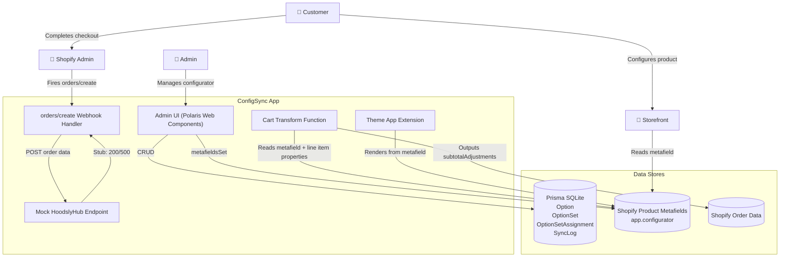
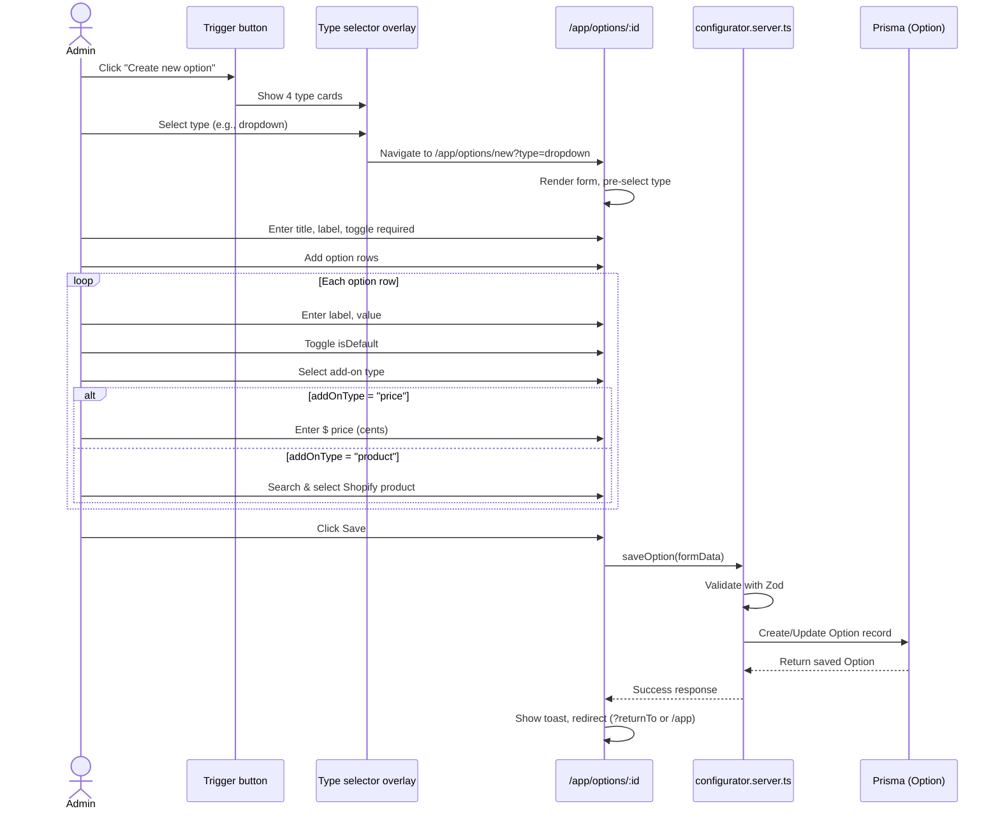
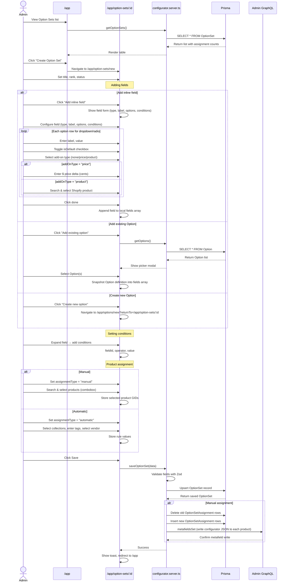
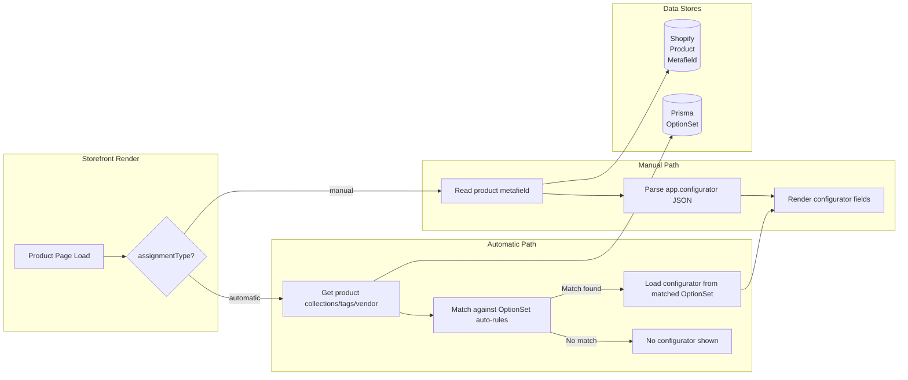
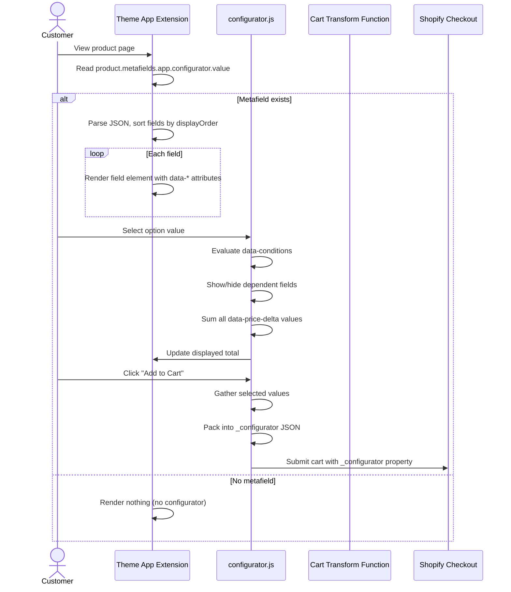
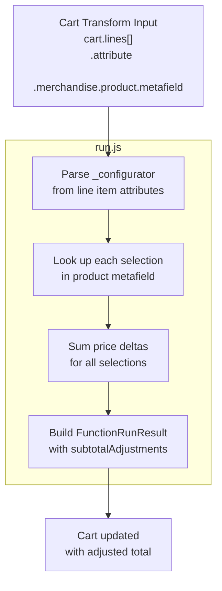
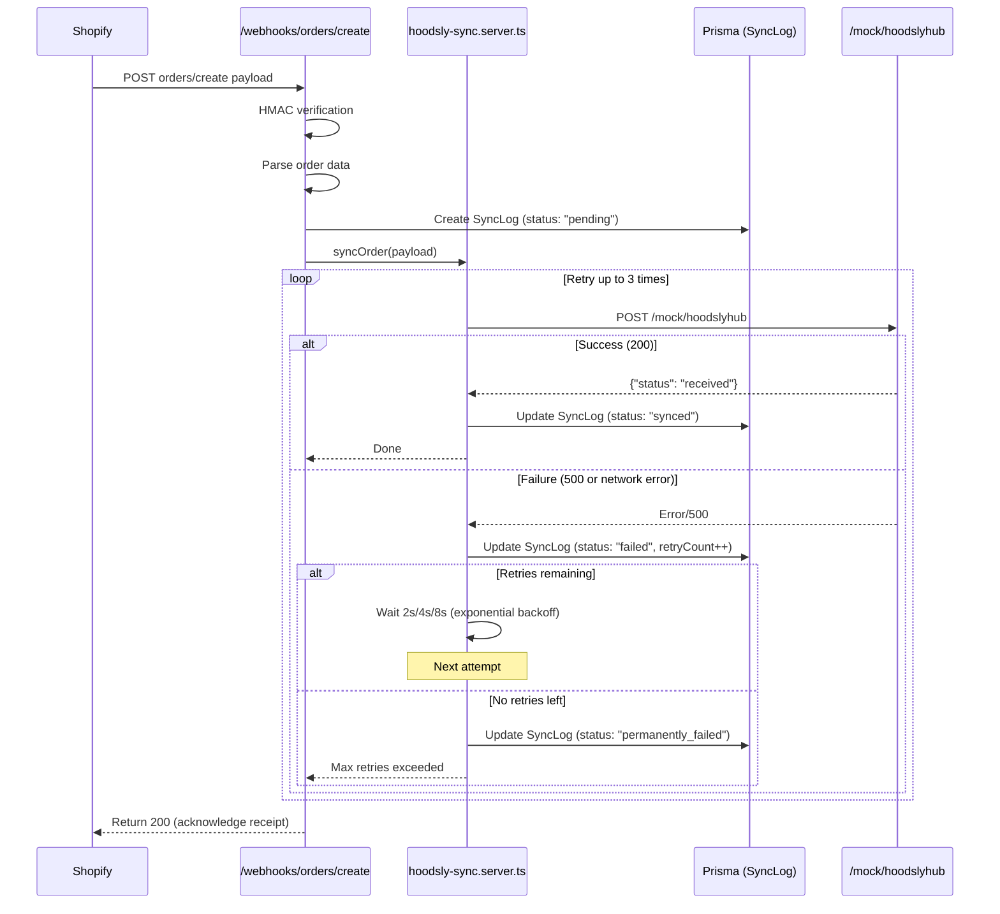
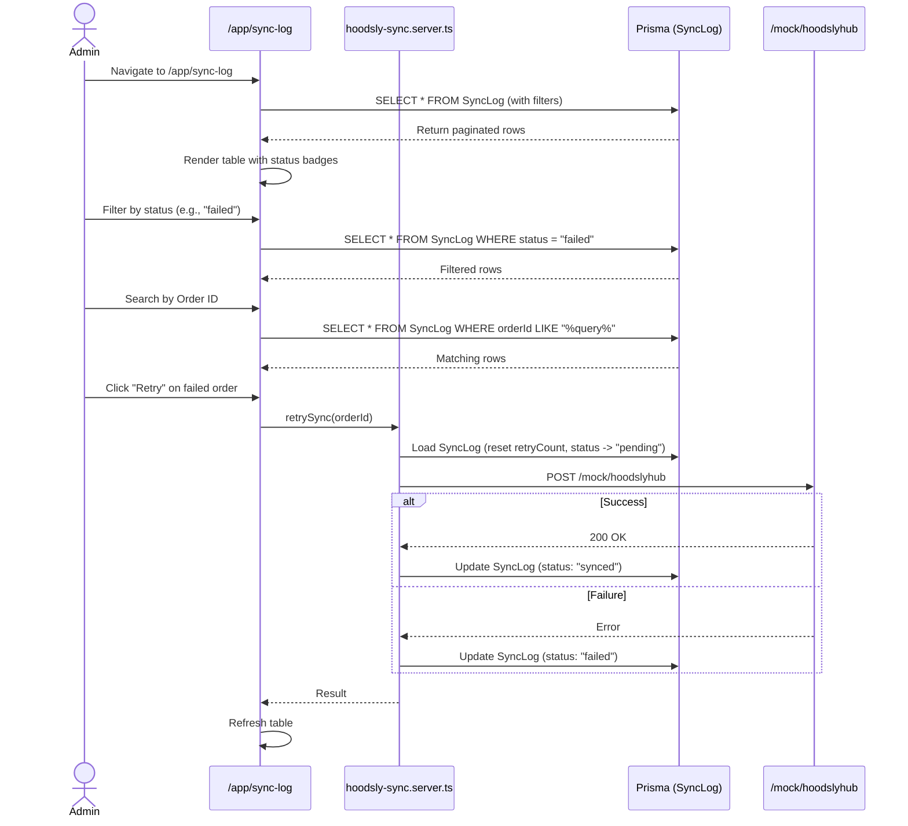
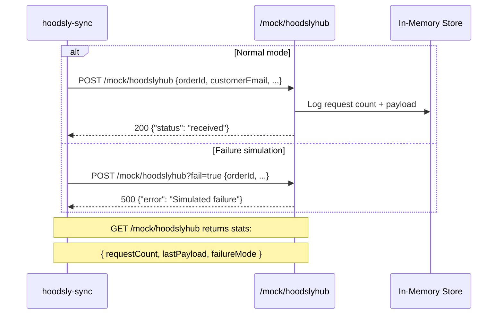
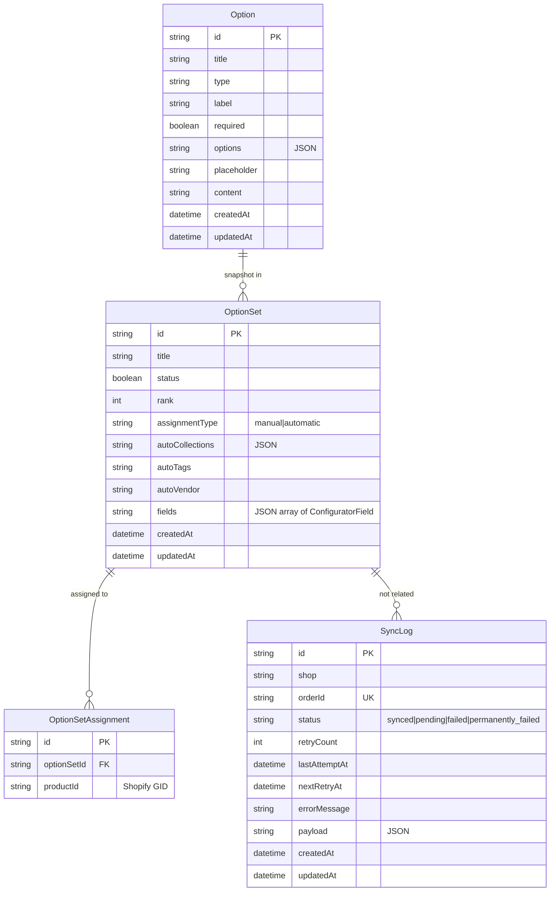

# ConfigSync — Data Flow Diagrams

## Legend

```
[External Entity]    — External system (Shopify, Customer, HoodslyHub)
(Process)            — Application logic (route handler, service)
{Data Store}         — Persistent storage (Prisma, Shopify metafield)
════ Data flow ═══╗ — Direction of data movement
```

---

## DFD Level 0 — Context Diagram



---

## DFD Level 1 — Option Creator Flow



### Data Flow — Option Save

```
Admin input → Form (Polaris Web Components)
  → POST /app/options/:id
    → configurator.server.ts (Zod validation)
      → Option table (Prisma)
        → id, title, type, label, required, options[{label, value, isDefault, addOnType, priceDelta?, addOnProductId?}], placeholder, content
```

---

## DFD Level 1 — Option Set Editor Flow



### Data Flow — Option Set Save

```
Admin input → Form (Polaris Web Components)
  → POST /app/option-sets/:id
    → configurator.server.ts (Zod validation)
      → OptionSet table (Prisma)
        → title, status, rank, assignmentType, fields[], autoCollections, autoTags, autoVendor
      → OptionSetAssignment table (Prisma)
        → [optionSetId, productId] rows (delete old, insert new)
      → Admin GraphQL metafieldsSet
        → product.metafields.app.configurator = JSON.stringify(Definition)
```

---

## DFD Level 1 — Product Assignment Resolution



---

## DFD Level 2 — Storefront Configurator Flow



### Data Flow — Add to Cart

```
Customer selections
  → configurator.js gathers {fieldId: {label, value, priceDelta}}
  → Packs into line item property "_configurator" (JSON string)
  → Submits to Shopify cart
  → Cart Transform Function reads:
      1. lineItem.attribute._configurator
      2. product.metafields.app.configurator
    → Matches selections to price deltas
    → Outputs cost.subtotalAdjustments
  → Shopify applies price adjusters to total
```

---

## DFD Level 2 — Cart Transform Function



---

## DFD Level 3 — Order Sync Flow



### Retry Backoff Schedule

```
Attempt 1 → Delay 0s (immediate) → POST → Failure
Attempt 2 → Delay 2s              → POST → Failure
Attempt 3 → Delay 4s              → POST → Failure
Attempt 4 → Delay 8s              → POST → "permanently_failed"
```

---

## DFD Level 3 — Admin Sync Log Flow



---

## DFD Level 3 — Mock HoodslyHub



---

## Entity-Relationship Flow



---

## End-to-End Flows

### Happy Path — Manual Configurator

```
Admin creates Option "Color" (Red +$5, Blue +$0)       → Option table
Admin creates OptionSet "Hood Configurator"             → OptionSet table
  → Adds existing Option "Color"
  → Adds inline field "Size" (Large +$10)
  → Sets condition: Size visible when Color = Red
  → Sets assignment: Manual → [Product "Test Hoodie"]
  → Saves                                             → OptionSetAssignment table
                                                       → Admin GraphQL metafieldsSet
                                                         → product.metafields.app.configurator

Customer visits "Test Hoodie" product page
  → Theme App Extension reads metafield
  → Renders Color dropdown (Red, Blue)
  → Customer selects "Red"
  → JS evaluates conditions: conditions met → show Size
  → Price display: Base + $5
  → Customer selects "Large"
  → Price display: Base + $5 + $10
  → Customer clicks "Add to Cart"
  → JS packs _configurator = {color: "Red", size: "Large"}
  → Cart Transform Function reads _configurator + metafield
  → Outputs subtotalAdjustments = $15
  → Cart total = Base + $15

Customer completes checkout
  → Order created with line item property _configurator
  → orders/create webhook fires
  → SyncLog created (pending → synced)
  → Admin sees order with configurator selections in Shopify admin
```

### Failure Path — Order Sync

```
Shopify fires orders/create

Webhook handler:
  1. Parse order payload → {}
  2. Create SyncLog (status: "pending", retryCount: 0)
  3. Call syncOrder(payload)

syncOrder:
  Attempt 1:
    POST /mock/hoodslyhub?fail=true → 500
    Update SyncLog (status: "failed", retryCount: 1)
    Wait 2s
  
  Attempt 2:
    POST /mock/hoodslyhub?fail=true → 500
    Update SyncLog (status: "failed", retryCount: 2)
    Wait 4s
  
  Attempt 3:
    POST /mock/hoodslyhub?fail=true → 500
    Update SyncLog (status: "failed", retryCount: 3)
    Wait 8s
  
  Attempt 4:
    POST /mock/hoodslyhub?fail=true → 500
    Update SyncLog (status: "permanently_failed", retryCount: 4)

Admin views /app/sync-log:
  → Sees order with "permanently_failed" badge
  → Clicks "Retry"
  → syncOrder() runs again (attempts reset)
  → If mock returns 200 → status back to "synced"
```

---

## Data Flow Summary Table

| Flow | Source | Process | Storage | Destination | Protocol |
|---|---|---|---|---|---|
| Create Option | Admin browser | `app.options.$id.tsx` → `configurator.server.ts` | Prisma `Option` | — | HTTP POST |
| Create Option Set | Admin browser | `app.option-sets.$id.tsx` → `configurator.server.ts` | Prisma `OptionSet` + `OptionSetAssignment` | Shopify Admin GraphQL (metafieldsSet) | HTTP POST |
| Read configurator | Storefront browser | Theme App Extension `configurator.liquid` | Shopify product metafield | Storefront DOM | Liquid render |
| Calculate price | Storefront browser | `configurator.js` | — | Cart form | DOM JS |
| Cart transform | Shopify cart | `cart-transform/src/run.js` | Product metafield + line item props | Shopify checkout | GraphQL Function |
| Order sync | Shopify webhook | `webhooks.orders.create.tsx` → `hoodsly-sync.server.ts` | Prisma `SyncLog` | `/mock/hoodslyhub` | HTTP POST |
| View sync log | Admin browser | `app.sync-log.tsx` | Prisma `SyncLog` | Admin browser | HTTP GET |
| Retry sync | Admin browser | `app.sync-log.tsx` → `hoodsly-sync.server.ts` | Prisma `SyncLog` | `/mock/hoodslyhub` | HTTP POST |
