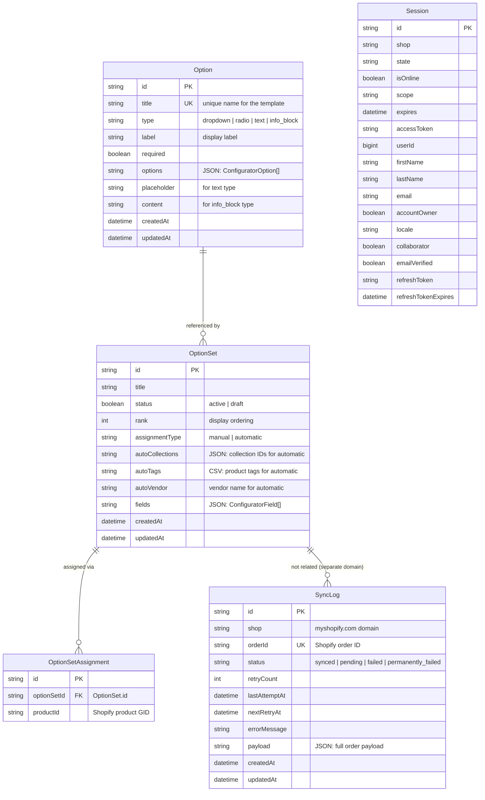

# ConfigSync — ERD Diagram & Relationship

## 1. Entity List

| Entity | Type | Description | Storage |
|---|---|---|---|
| `Option` | Prisma Model | Reusable field template used as building blocks for Option Sets | SQLite via Prisma |
| `OptionSet` | Prisma Model | Configurator definition with fields, rules, and assignment configuration | SQLite via Prisma |
| `OptionSetAssignment` | Prisma Model | Normalized many-to-many mapping between Option Sets and products | SQLite via Prisma |
| `SyncLog` | Prisma Model | Order sync audit trail with retry status | SQLite via Prisma |
| `Session` | Prisma Model | Shopify session storage (existing, from template) | SQLite via Prisma |
| `ConfiguratorDefinition` | JSON (metafield) | The full configurator JSON written to product metafield at sync time | Shopify Product Metafield |

---

## 2. Entity-Relationship Diagram



---

## 3. Relationship Detail

### 3.1 Option → OptionSet

| Relationship | Type | Cardinality | Description |
|---|---|---|---|
| Option referenced by OptionSet | Composition | One-to-Many | An Option can be snapshotted into many Option Sets. However, the relationship is **logical, not enforced by FK** — the OptionSet stores a full copy (snapshot) of the Option's field definition in its `fields` JSON at the time of addition. This avoids live-reference sync issues. |

```
Option (1) ──→ OptionSet (N)
  "Color"         "Hood Configurator"
                  "T-shirt Configurator"
                  "Jacket Configurator"
```

**Important**: The snapshot means:
- Editing an Option after adding it to Option Sets does NOT update the existing snapshots
- The Option template serves as a starting point / preset
- To apply changes to existing Option Sets, admin must re-add the Option

### 3.2 OptionSet → OptionSetAssignment

| Relationship | Type | Cardinality | Description |
|---|---|---|---|
| OptionSet has assignments | Composition | One-to-Many | An Option Set can have zero or many product assignments. This is the normalized mapping for manual product assignment. |

```
OptionSet (1) ──→ OptionSetAssignment (N)
  "Hood Configurator"    optionSetId: "abc", productId: "gid://shopify/Product/1"
                         optionSetId: "abc", productId: "gid://shopify/Product/2"
                         optionSetId: "abc", productId: "gid://shopify/Product/3"
```

**Cascade delete**: When an OptionSet is deleted, all its assignments are deleted automatically.

### 3.3 OptionSetAssignment → Shopify Product

| Relationship | Type | Cardinality | Description |
|---|---|---|---|
| Assignment to product | Reference (logical) | Many-to-One | Many OptionSetAssignments can point to the same product. This enables multiple Option Sets per product (in future). |

```
OptionSetAssignment (N) ──→ Shopify Product (1)
  optionSetId: "abc", productId: "gid://shopify/Product/1"
  optionSetId: "xyz", productId: "gid://shopify/Product/1"
```

### 3.4 OptionSetAssignment Indexes

| Index | Columns | Purpose |
|---|---|---|
| Primary key | `id` | Row identity |
| Unique | `[optionSetId, productId]` | Prevent duplicate assignment |
| Index | `productId` | Fast lookup: "Which OptionSets for product X?" |
| Index | `optionSetId` | Fast lookup: "Which products for OptionSet Y?" |

### 3.5 Session → Others

Session is standalone. No FK relationships to other entities.

### 3.6 SyncLog → Others

SyncLog is standalone. It records events triggered by Shopify's `orders/create` webhook and is managed independently.

---

## 4. Logical Data Flow (Option → Product Resolution)

### Manual Assignment Path

```
Option ──→ OptionSet.fields (snapshot) ──→ OptionSetAssignment.productId
                                                │
                                                ▼
                                         Shopify Product
                                         metafield.app.configurator
                                         (written by configurator.server.ts
                                          via Admin GraphQL metafieldsSet)
                                                │
                                                ▼
                                         Theme App Extension reads metafield
                                         → renders configurator
```

### Automatic Assignment Path

```
Option ──→ OptionSet.fields (snapshot) ──→ OptionSet.autoCollections
                                         → OptionSet.autoTags
                                         → OptionSet.autoVendor
                                                │
                                                ▼
                                         Theme App Extension:
                                         1. Read current product's collections/tags/vendor
                                         2. Match against OptionSet auto-rules
                                         3. If match → render fields from OptionSet.fields
```

---

## 5. JSON Document Structures

### 5.1 Option.options (ConfiguratorOption[])

```json
[
  {
    "label": "Red",
    "value": "red",
    "isDefault": true,
    "addOnType": "price",
    "priceDelta": 500
  },
  {
    "label": "Blue",
    "value": "blue",
    "isDefault": false,
    "addOnType": "price",
    "priceDelta": 0
  },
  {
    "label": "Extended Warranty",
    "value": "warranty_plus",
    "isDefault": false,
    "addOnType": "product",
    "addOnProductId": "gid://shopify/Product/98765"
  }
]
```

### 5.2 OptionSet.fields (ConfiguratorField[])

```json
[
  {
    "id": "fld_color",
    "type": "dropdown",
    "label": "Color",
    "required": true,
    "displayOrder": 0,
    "options": [
      { "label": "Red", "value": "red", "isDefault": true, "addOnType": "price", "priceDelta": 500 },
      { "label": "Blue", "value": "blue", "isDefault": false, "addOnType": "price", "priceDelta": 0 }
    ],
    "conditions": []
  },
  {
    "id": "fld_size",
    "type": "radio",
    "label": "Size",
    "required": true,
    "displayOrder": 1,
    "options": [
      { "label": "Small", "value": "sm", "isDefault": false, "addOnType": "price", "priceDelta": 0 },
      { "label": "Large", "value": "lg", "isDefault": false, "addOnType": "price", "priceDelta": 1000 }
    ],
    "conditions": [
      { "fieldId": "fld_color", "operator": "equals", "value": "red" }
    ]
  },
  {
    "id": "fld_custom_text",
    "type": "text",
    "label": "Engraving Text",
    "required": false,
    "displayOrder": 2,
    "placeholder": "Enter text to engrave",
    "conditions": [
      { "fieldId": "fld_size", "operator": "equals", "value": "lg" }
    ]
  }
]
```

### 5.3 SyncLog.payload

```json
{
  "orderId": "gid://shopify/Order/12345",
  "customerEmail": "customer@example.com",
  "lineItems": [
    {
      "productId": "gid://shopify/Product/678",
      "variantId": "gid://shopify/ProductVariant/999",
      "sku": "HOOD-RED-LG",
      "title": "Premium Hoodie",
      "quantity": 1,
      "price": 11500,
      "properties": {
        "_configurator": "{\"fld_color\": {\"label\":\"Red\",\"value\":\"red\",\"priceDelta\":500},\"fld_size\":{\"label\":\"Large\",\"value\":\"lg\",\"priceDelta\":1000}}"
      }
    }
  ],
  "shippingAddress": {
    "firstName": "John",
    "lastName": "Doe",
    "address1": "123 Main St",
    "city": "Anytown",
    "province": "CA",
    "zip": "12345",
    "country": "US"
  },
  "totalPrice": 11500
}
```

---

## 6. Full Schema SQL (Prisma Representation)

```prisma
// This is your Prisma schema file,
// learn more about it in the docs: https://pris.ly/d/prisma-schema

generator client {
  provider = "prisma-client-js"
}

datasource db {
  provider = "sqlite"
  url      = "file:dev.sqlite"
}

// ───────────────────────────────────────
// Existing — Shopify session storage
// ───────────────────────────────────────

model Session {
  id            String    @id
  shop          String
  state         String
  isOnline      Boolean   @default(false)
  scope         String?
  expires       DateTime?
  accessToken   String
  userId        BigInt?
  firstName     String?
  lastName      String?
  email         String?
  accountOwner  Boolean   @default(false)
  locale        String?
  collaborator  Boolean?  @default(false)
  emailVerified Boolean?  @default(false)
  refreshToken        String?
  refreshTokenExpires DateTime?
}

// ───────────────────────────────────────
// NEW — Reusable field templates
// ───────────────────────────────────────

model Option {
  id          String   @id @default(uuid())
  title       String
  type        String   // "dropdown" | "radio" | "text" | "info_block"
  label       String
  required    Boolean  @default(false)
  options     String?  // JSON array of ConfiguratorOption:
                       // [{label, value, isDefault, addOnType, priceDelta?, addOnProductId?}]
  placeholder String?  // for text
  content     String?  // for info_block
  createdAt   DateTime @default(now())
  updatedAt   DateTime @updatedAt
}

// ───────────────────────────────────────
// NEW — Configurator definitions
// ───────────────────────────────────────

model OptionSet {
  id              String    @id @default(uuid())
  title           String
  status          Boolean   @default(true)
  rank            Int       @default(0)
  assignmentType  String    // "manual" | "automatic"
  autoCollections String?   // JSON array of collection IDs (for automatic)
  autoTags        String?   // Comma-separated product tags (for automatic)
  autoVendor      String?   // Vendor name (for automatic)
  fields          String    // JSON array of ConfiguratorField:
                            // [{id, type, label, required, displayOrder,
                            //   options: ConfiguratorOption[],
                            //   conditions: [{fieldId, operator, value}],
                            //   defaultValue, placeholder, content}]
  createdAt       DateTime  @default(now())
  updatedAt       DateTime  @updatedAt

  assignments     OptionSetAssignment[]

  @@index([status])
  @@index([assignmentType])
}

// ───────────────────────────────────────
// NEW — Normalized product-to-OptionSet mapping
// ───────────────────────────────────────

model OptionSetAssignment {
  id          String    @id @default(uuid())
  optionSetId String
  optionSet   OptionSet @relation(fields: [optionSetId], references: [id], onDelete: Cascade)
  productId   String    // Shopify product GID (e.g., "gid://shopify/Product/12345")

  @@unique([optionSetId, productId])
  @@index([productId])
  @@index([optionSetId])
}

// ───────────────────────────────────────
// NEW — Order sync audit trail
// ───────────────────────────────────────

model SyncLog {
  id            String   @id @default(uuid())
  shop          String
  orderId       String   @unique
  status        String   // "synced" | "pending" | "failed" | "permanently_failed"
  retryCount    Int      @default(0)
  lastAttemptAt DateTime?
  nextRetryAt   DateTime?
  errorMessage  String?
  payload       String   // JSON
  createdAt     DateTime @default(now())
  updatedAt     DateTime @updatedAt

  @@index([status])
  @@index([orderId])
}
```

---

## 7. Index Strategy

| Table | Index | Type | Purpose |
|---|---|---|---|
| `OptionSet` | `[status]` | Non-unique B-tree | Filter dashboard by active/draft |
| `OptionSet` | `[assignmentType]` | Non-unique B-tree | Filter by manual/automatic |
| `OptionSetAssignment` | `[productId]` | Non-unique B-tree | High-frequency: "find OptionSets for product" |
| `OptionSetAssignment` | `[optionSetId]` | Non-unique B-tree | "find products for OptionSet" |
| `OptionSetAssignment` | `[optionSetId, productId]` | Unique | Prevent duplicate assignments |
| `SyncLog` | `[status]` | Non-unique B-tree | Filter sync log by status |
| `SyncLog` | `[orderId]` | Non-unique B-tree | Search sync log by order ID |

---

## 8. Data Constraints & Validations

### Option Table

| Field | Constraint | Zod Rule |
|---|---|---|
| `id` | `@id @default(uuid())` | Auto-generated |
| `title` | Required, unique per admin context | `z.string().min(1).max(255)` |
| `type` | Required, enum | `z.enum(["dropdown","radio","text","info_block"])` |
| `label` | Required | `z.string().min(1).max(255)` |
| `required` | Default `false` | `z.boolean()` |
| `options` | Required if type = "dropdown" or "radio" | `z.array(optionSchema).min(1)` |
| `placeholder` | Only for type = "text" | `z.string().optional()` |
| `content` | Only for type = "info_block" | `z.string().optional()` |

### OptionSet Table

| Field | Constraint | Zod Rule |
|---|---|---|
| `id` | `@id @default(uuid())` | Auto-generated |
| `title` | Required | `z.string().min(1).max(255)` |
| `status` | Default `true` | `z.boolean()` |
| `rank` | Default `0` | `z.number().int().min(0)` |
| `assignmentType` | Required, enum | `z.enum(["manual","automatic"])` |
| `autoCollections` | Only for automatic | `z.string().optional()` (validated as parseable JSON array) |
| `autoTags` | Only for automatic | `z.string().optional()` |
| `autoVendor` | Only for automatic | `z.string().optional()` |
| `fields` | Required | `z.array(fieldSchema).min(1)` (validated ConfiguratorField array) |

### ConfiguratorOption Validation

```typescript
const optionSchema = z.object({
  label: z.string().min(1).max(255),
  value: z.string().min(1).max(255),
  isDefault: z.boolean(),
  addOnType: z.enum(["none", "price", "product"]),
  priceDelta: z.number().int().min(0).optional(),
  addOnProductId: z.string().optional(),
}).refine((data) => {
  if (data.addOnType === "price" && (data.priceDelta === undefined || data.priceDelta < 0)) {
    return false;
  }
  if (data.addOnType === "product" && !data.addOnProductId) {
    return false;
  }
  return true;
});
```

### VisibilityCondition Validation

```typescript
const conditionSchema = z.object({
  fieldId: z.string().min(1),
  operator: z.enum(["equals", "not_equals"]),
  value: z.string(),
});
```

### ConfiguratorField Validation

```typescript
const fieldSchema = z.object({
  id: z.string().min(1),
  type: z.enum(["dropdown", "radio", "text", "info_block"]),
  label: z.string().min(1).max(255),
  required: z.boolean(),
  displayOrder: z.number().int().min(0),
  options: z.array(optionSchema).optional(),
  conditions: z.array(conditionSchema).optional(),
  defaultValue: z.string().optional(),
  placeholder: z.string().optional(),
  content: z.string().optional(),
}).refine((data) => {
  if (["dropdown", "radio"].includes(data.type) && (!data.options || data.options.length === 0)) {
    return false;
  }
  return true;
});
```

---

## 9. Row-by-Row Relationship Matrix

| Data | Option | OptionSet | OptionSetAssignment | SyncLog | Session |
|---|---|---|---|---|---|
| **Option** | — | Snapshot reference | — | — | — |
| **OptionSet** | Contains snapshot | — | Has many | — | — |
| **OptionSetAssignment** | — | Belongs to | — | — | — |
| **SyncLog** | — | — | — | — | — |
| **Session** | — | — | — | — | — |
| **Shopify Product** | — | Via Assignment | References productId | — | — |
| **Shopify Metafield** | — | Written by | — | — | — |
| **Shopify Order** | — | — | — | References orderId | — |

---

## 10. Migration Sequence

When implementing the schema, apply migrations in this order:

```bash
# Step 1: Add Option, OptionSet, OptionSetAssignment, SyncLog
npx prisma migrate dev --name add_configurator_and_sync_models

# Step 2: Generate Prisma client
npx prisma generate

# Step 3: Verify
npx prisma studio
```

The existing `Session` table is left untouched.
