# ConfigSync — User Journey & Technical Flow

## 1. User Personas

| Persona | Role | Goals |
|---|---|---|
| **Admin** | Store administrator | Create configurator definitions, assign to products, monitor order sync |
| **Customer** | Storefront shopper | Configure product, see price updates, complete checkout |
| **Developer** | App maintainer | Debug sync issues, understand system behavior |

---

## 2. Admin Journeys

### Journey A: Create a Reusable Option (Field Template)

**Entry**: Admin clicks "Create new option" from anywhere in the app

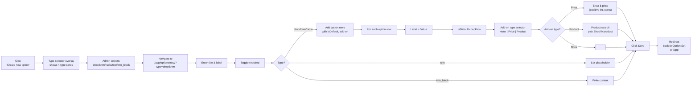

**Technical flow**:

```
Step | User Action               | Frontend                           | Backend                      | Data Store
------+---------------------------+------------------------------------+------------------------------+---------------------------
1     | Click "Create new option"  | app.option-sets.$id.tsx or dashboard | —                          | —
2     | See type selector overlay  | TypeSelector component              | —                          | —
3     | Select type (e.g., dropdown) | navigate("/app/options/new?type=dropdown") | —                    | —
4     | Navigate to create page    | app.options.$id.tsx reads ?type=    | loader → authenticate.admin  | —
5     | Fill title, label, toggle required | Polaris form components       | —                            | —
6     | Add option rows            | add/remove rows in state           | —                            | —
7     | Per row: set label, value, isDefault | checkbox + text inputs       | —                            | —
8     | Per row: set add-on type   | select: None/Price/Product        | —                            | —
9     | Per row: if Price, enter amount     | number input               | —                            | —
10    | Per row: if Product, search product | Product combobox            | Admin GraphQL products(query:) | Shopify products
11    | Click Save                | ui-save-bar → fetcher.submit      | action → configurator.server.ts | —
12    | —                         | —                                  | saveOption(data)             | Zod validate data
13    | —                         | —                                  | prisma.option.create(data)   | Option table
14    | —                         | —                                  | Return Option.id             | —
15    | —                         | toast.show("Saved")                | —                            | —
16    | Redirected                | navigate(?returnTo or /app)        | —                            | —
```

**Validation rules applied by Zod**:
- `title`: required, string, max 255 chars
- `type`: required, enum ["dropdown", "radio", "text", "info_block"]
- `label`: required, string
- `options`: required if type is dropdown/radio, array of:
  - `{label, value}`: required strings
  - `isDefault`: boolean
  - `addOnType`: enum ["none", "price", "product"]
  - `priceDelta`: required positive int (cents) if addOnType = "price"
  - `addOnProductId`: required string (Shopify GID) if addOnType = "product"
- `placeholder`: string, only for type "text"
- `content`: string, only for type "info_block"

---

### Journey B: Create an Option Set (Configurator) + Assign to Products

**Entry**: Admin navigates to `/app/option-sets/new`

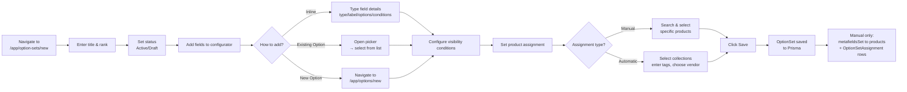

**Technical flow — Full Save**:

```
Step | User Action                  | Frontend                          | Backend                                    | Data Store
------+------------------------------+-----------------------------------+--------------------------------------------+---------------------------
1     | Navigate to /app/option-sets/new | app.option-sets.$id.tsx          | loader → authenticate.admin                | —
2     | Fill title, rank, fields    | React state (fields[])            | —                                          | —
3     | Add inline field            | push to fields[], update UI       | —                                          | —
4     | Add existing Option         | fetch /app/options (API or loader)| getOptions() → prisma.option.findMany()    | Option table
5     |                               | snapshot Option definition into fields[] | —                                    | —
6     | Configure conditions        | update fields[i].conditions[]    | —                                          | —
7     | Manual: search products     | Admin GraphQL products(query:)    | —                                          | Shopify products
8     | Automatic: set rules         | store autoCollections, autoTags, autoVendor | —                                   | —
9     | Click Save                  | ui-save-bar → fetcher.submit     | action → saveOptionSet(data)               | —
10    | —                           | —                                | Zod validation on fields JSON               | —
11    | —                           | —                                | prisma.optionSet.upsert()                  | OptionSet table
12    | —                           | —                                | prisma.optionSetAssignment.deleteMany()    | Assignment table
13    | —                           | —                                | prisma.optionSetAssignment.createMany()    | Assignment table
14    | —                           | —                                | For each manual product:                    |
15    | —                           | —                                |   admin.graphql(metafieldsSet)             | Product metafield
16    | —                           | —                                | Return success                             | —
17    | —                           | shopify.toast.show("Saved")      | —                                          | —
18    | Redirected to /app           | navigate("/app")                 | —                                          | —

```

**Products affected per assignment type**:

```
Manual:
  → OptionSetAssignment[optionSetId, productId1]
  → OptionSetAssignment[optionSetId, productId2]
  → productId1.metafields.app.configurator = JSON.stringify(fields)
  → productId2.metafields.app.configurator = JSON.stringify(fields)

Automatic:
  → OptionSet.autoCollections = "[collectionId1, collectionId2]"
  → OptionSet.autoTags = "premium,limited"
  → OptionSet.autoVendor = "Acme Inc"
  → NO metafield writes (resolved at render time)
```

---

### Journey C: View & Retry Order Sync

**Entry**: Admin navigates to `/app/sync-log`

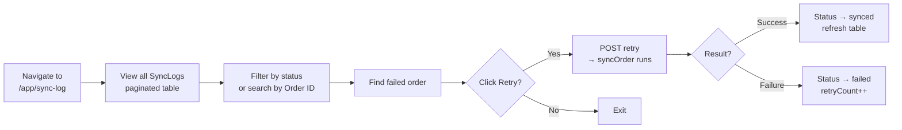

**Technical flow — Retry**:

```
Step | User Action            | Frontend              | Backend                          | Data Store
------+------------------------+-----------------------+----------------------------------+---------------------------
1     | Navigate to /app/sync-log | app.sync-log.tsx    | loader → prisma.syncLog.findMany() | SyncLog table
2     | Filter by "failed"     | client-side filter    | —                                | —
3     | Click "Retry"          | fetcher.submit({orderId}) | action → hoodsly-sync.server.ts | —
4     | —                      | —                     | Load SyncLog by orderId           | SyncLog table
5     | —                      | —                     | Reset retryCount = 0              | SyncLog table
6     | —                      | —                     | POST /mock/hoodslyhub             | Mock endpoint
7     | —                      | —                     | On 200: status = "synced"         | SyncLog table
8     | —                      | —                     | On 500: status = "failed"         | SyncLog table
9     | Table refreshes        | revalidate loader     | Return updated SyncLog            | —
```

---

## 3. Customer Journey

### Journey D: Configure Product on Storefront

**Entry**: Customer visits a product page that has a configurator

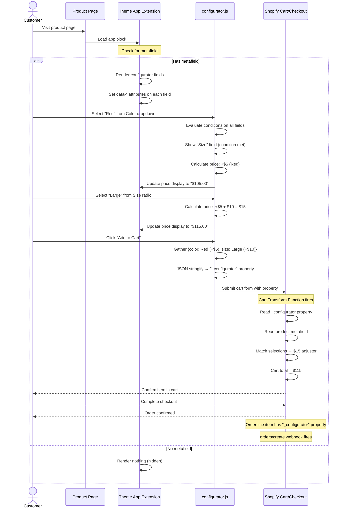

### Conditional Visibility — Decision Tree

```
Customer selects Color = "Red"
  → JS iterates all fields' conditions
  → For field "Size":
       conditions = [{sourceFieldId: "color", operator: "equals", value: "Red"}]
       → Check: current value of field "color" === "Red" → true
       → Show "Size" field (display: block)
  → For field "Trim":
       conditions = [{sourceFieldId: "color", operator: "not_equals", value: "Blue"}]
       → Check: current value of field "color" === "Red" → "Red" !== "Blue" → true
       → Show "Trim" field
  → Fields with no conditions → always visible
  → Fields where conditions fail → hidden (display: none)
```

### Price Calculation — Customer View

```
                 ┌─────────────────────────┐
                 │  Premium Range Hood      │
                 │  Base Price: $100.00     │
                 ├─────────────────────────┤
                 │  Color: ● Red [+$5.00]  │  ← dropdown
                 │         ○ Blue          │
                 ├─────────────────────────┤
                 │  Size:  ○ Small         │  ← radio, shown when
                 │         ● Large [+$10]  │     Color = Red
                 ├─────────────────────────┤
                 │  Total: $115.00         │  ← live update
                 ├─────────────────────────┤
                 │  [ + Add to Cart ]      │
                 └─────────────────────────┘
```

---

## 4. Technical Flows

### Flow 1: Option CRUD

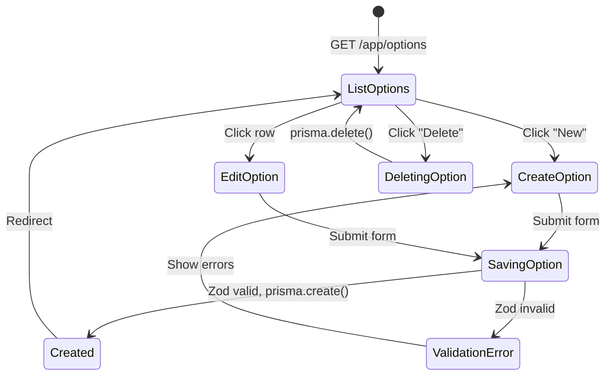

### Flow 2: Option Set Save with Manual Assignment

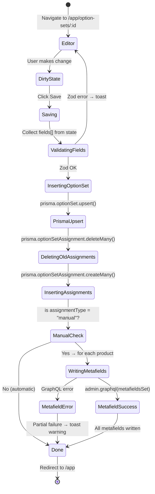

### Flow 3: Automatic Assignment Resolution at Storefront

This flow happens on every product page load when no metafield exists yet.

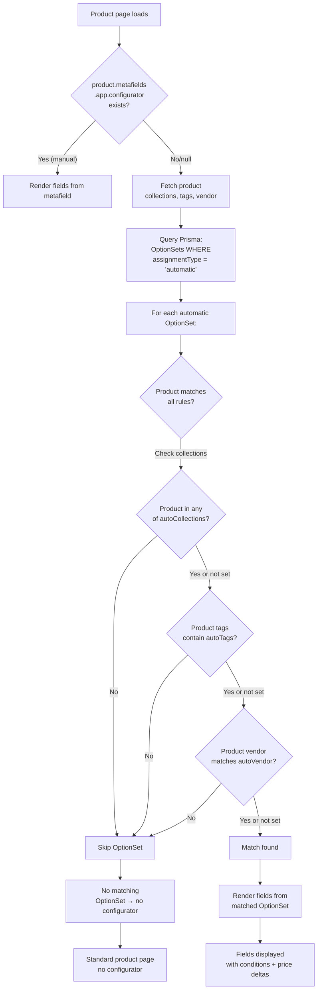

### Flow 4: Order Sync — Full Lifecycle

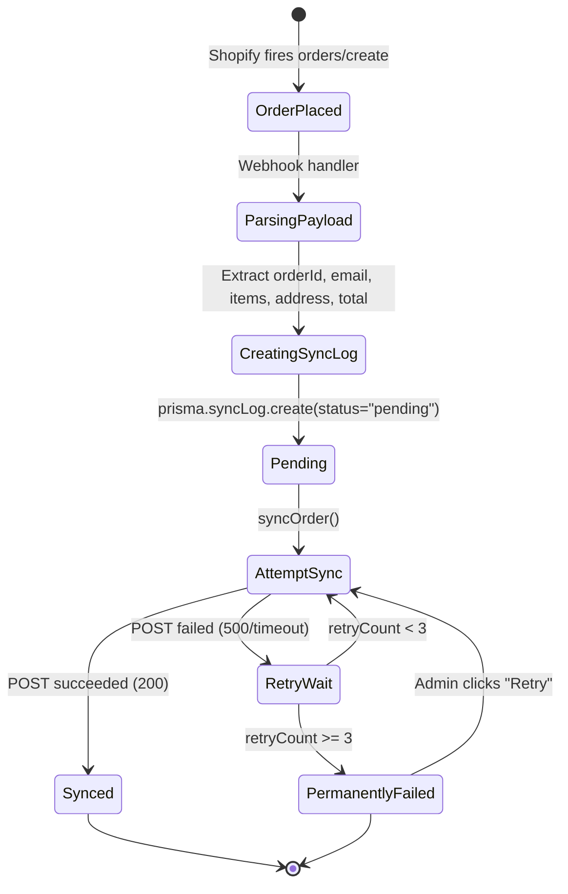

### Flow 5: Cart Transform Function Execution

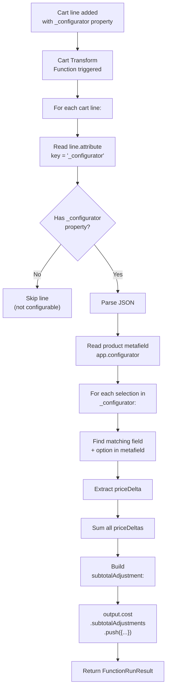

### Flow 6: Admin Sync Log Filters

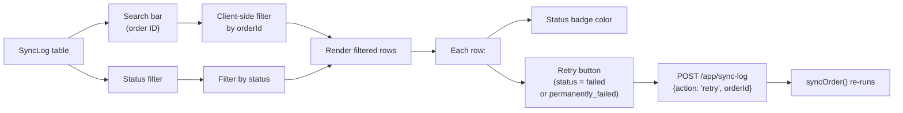

---

## 5. Error Handling Flows

### Scenario: Admin saves Option Set but GraphQL metafieldsSet fails

```
1. Prisma OptionSet saved successfully
2. Prisma OptionSetAssignment saved successfully
3. Shopify GraphQL metafieldsSet for product A → success
4. Shopify GraphQL metafieldsSet for product B → ERROR (product deleted?)
5. System behavior:
   → Individual failure per product does NOT rollback the entire save
   → Remaining products continue (product C, D are written)
   → Toast shows: "Saved with warnings: 1 product failed"
   → Error logged to console
   → Admin can edit and re-save to retry failed products
```

### Scenario: Webhook receives order but HoodslyHub is down

```
1. orders/create webhook received → HTTP 200 returned immediately
2. SyncLog created with status "pending"
3. syncOrder() called in background:
   → Attempt 1: POST fails (connection refused) → wait 2s
   → Attempt 2: POST fails (timeout) → wait 4s
   → Attempt 3: POST fails (500) → wait 8s
   → Attempt 4: POST fails → status = "permanently_failed"
4. Admin views /app/sync-log → sees permanently_failed
5. Admin clicks Retry after HoodslyHub is restored
6. syncOrder() runs again, succeeds → status = "synced"
```

### Scenario: Customer adds configurable product without _configurator property

```
1. Cart Transform Function receives line
2. line.attribute("_configurator") is null
3. Function does NOT add any subtotalAdjustment
4. Customer pays base price only
5. No configurator data appears in line item properties
```

---

## 6. Flow Timing & Dependencies

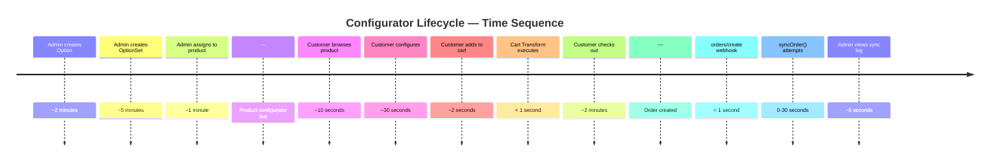

---

## 7. Cross-Flow Dependencies

| Flow | Depends On | Triggered By | Async? |
|---|---|---|---|
| Option CRUD | — | Admin UI action | No |
| Option Set CRUD | Option data (for "add existing") | Admin UI action | No |
| Product metafield write | OptionSet saved | Option Set save (manual) | No (sequential per product) |
| Storefront render | Product metafield (manual) OR | Product page load | No |
|  | OptionSet auto-rules (automatic) | | |
| Cart transform | Cart line with `_configurator` | Add to cart | No |
| Order sync webhook | Order created | Shopify event | No |
| Retry sync | Failed SyncLog | Admin manual click | Yes (awaited) |
| Sync log view | SyncLog data | Admin navigation | No |
